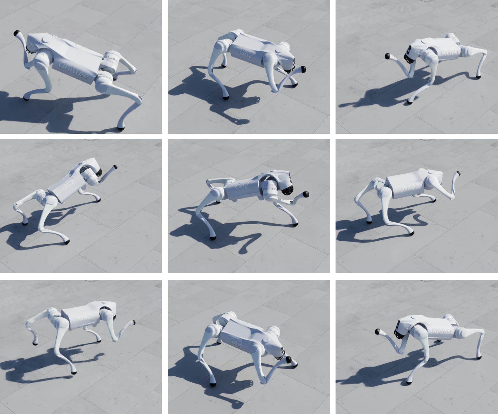

# FootReach

基于IsaacLab，使用PPO 训练四足狗将其右前脚`FR_foot`伸向给定的空中3-dof目标点；




- 给定的目标点每3s随机更新一次，采样区域为`pos_x=(0.4, 0.45)，pos_y=(-0.1, 0.0)，pos_z=(-0.1, 0.1)` 目标点参考系为狗自身的base坐标系；

- `目标欧式距离误差`考虑设计为正奖励，鼓励智能体进行正向探索，而不采取`自杀`等怯懦行为；


## 配置
- IsaacSim 4.5.0
- Ubuntu 24.04
- IsaacLab commit ID `868d03a`


## 结构
```bash

foot_reach # 对每个任务建立单独的文件夹
├── config
│   ├── go2 # 对不同硬件建立单独文件夹
│   │   ├── agents # 所使用的RL智能体配置文件
│   │   │   ├── __init__.py
│   │   │   ├── rsl_rl_ppo_cfg.py
│   │   │   ├── skrl_flat_ppo_cfg.yaml
│   │   │   └── skrl_rough_ppo_cfg.yaml
│   │   ├── __init__.py # 在这里完成对gym环境的注册，使得能够用名称访问环境
│   │   ├── flat_env_cfg.py # 平坦地形环境
│   │   └── rough_env_cfg.py # 继承自基础环境，特定于当前硬件的环境进一步配置（崎岖地形）
│   └── __init__.py 
├── figs
│   └── all.png
├── foot_reach_env_cfg.py # 基础环境的配置，
├── __init__.py
├── mdp
│   ├── __init__.py 
│   ├── curriculums.py # 用于课程学习，这里没有用到
│   ├── rewards.py # 任务相关的奖励函数，可以进行自定义
│   └── terminations.py # 终止条件判别
└── README.md

```


## 安装

- 克隆本仓库至IsaacLab指定路径下
```bash
cd <path to IsaacLab>/IsaacLab/source/isaaclab_tasks/isaaclab_tasks/manager_based/locomotion/

git clone https://github.com/Hymwgk/foot_reach.git
```


## 使用

- 训练 500回合就基本收敛了
```bash
./isaaclab.sh -p  scripts/reinforcement_learning/rsl_rl/train.py  --task Isaac-FootReach-Rough-Unitree-Go2-v0 --num_envs 4068 --video --headless --max_iterations 500
```


- 测试
```bash
./isaaclab.sh -p  scripts/reinforcement_learning/rsl_rl/play.py  --task Isaac-FootReach-Rough-Unitree-Go2-Play-v0
```


## 可能改进点

本仓库仅仅是为了接触学习IsaacLab和快速实现任务设计，这里为感兴趣者提供如下改进思路：

- 目前空中目标点仅仅考虑了3-Dof position L2误差，可考虑更改目标形式，修改reward实现足端6-Dof姿态控制
- 奖励函数目前主要考虑了`机身非法接触`,`目标欧式距离误差`两个方面，没有直接设计快速性、稳定性等相关针对性奖励（尽管收敛后也会隐式地考虑到这些因素）
- 目前给定的目标位置是相对于自身base坐标系的，可以考虑更改目标点给定形式，以世界坐标系为参考系给定目标点，实现机械狗现自主移动到大致区域，再伸腿至目标点。（修改L2 reward奖励）